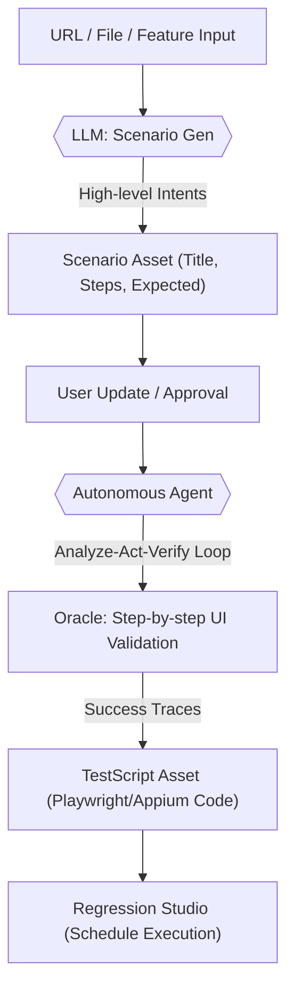
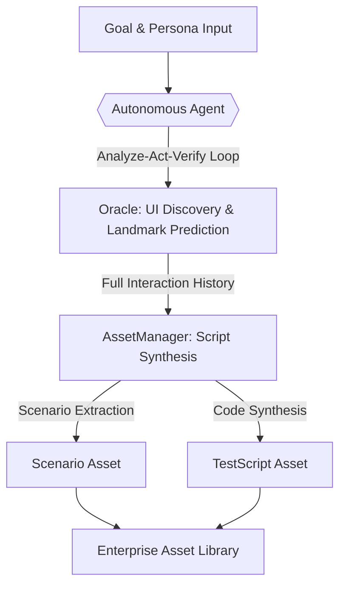
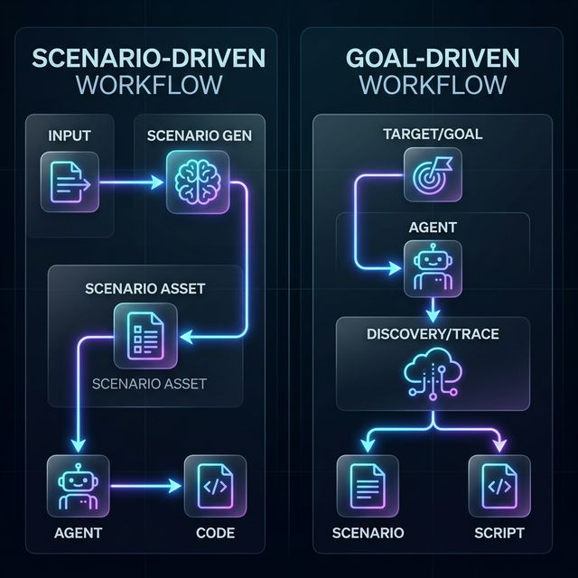

# AI Generator: LLM Specification & Technical Protocol

이 문서는 Q-ONE의 실제 백엔드 소스 코드(`scenarios.py`, `ai.py`, `exploration.py`, `asset_manager.py`) 분석을 기반으로 작성되었습니다. AI 에이전트(Oracle)과 Google Gemini 2.0 모델 간의 통신 프로토콜, 프롬프트 전략 및 입출력 규격을 정의하며, LLM 튜닝 및 성능 최적화를 위한 실질적인 참조 자료로 사용됩니다.

---

## 1. 개요 및 핵심 기술 (Core Technical Foundation)

Q-ONE의 AI Generator는 Gemini 2.0 모델을 핵심 엔진으로 사용하여 시나리오 설계부터 실행 데이터 생성, 그리고 자율 탐색을 통한 자산화까지의 전 과정을 자동화합니다.

*   **LLM Engine**: Google Gemini 2.0 (Pro/Flash) - 멀티모달 분석(이미지+텍스트) 및 JSON Schema 출력이 핵심.
*   **Browsing/Crawl**: 
    *   **WEB**: Playwright (CrawlerService) - 헤드리스 브라우저 제어 및 DOM 트리 추출.
    *   **APP**: Appium (app_step_runner) - Android/iOS 네이티브 앱 UI 및 XML 소스 분석.
*   **Vision Analysis**: 스크린샷과 최적화된 DOM 구조를 동시에 LLM에 주입하여 요소 식별 정확도 극대화.
*   **Automation Pipeline**: `AssetManager` 서비스를 통해 AI 탐색 이력을 `Playwright/Appium` 실행 코드로 즉시 변환하고, 입력 리터럴 값을 분석하여 `{{FIELD}}` 형태의 변수를 자동 주입(Parameterization)합니다.

---

## 2. Scenario Generation (시나리오 생성 프로토콜)
*   **진입점**: `/scenarios/analyze-url`, `/scenarios/analyze-upload`
*   **모델**: `gemini-2.0-flash-exp` (또는 설정된 모델)

### 2.1. System Prompt (전체 시스템 프롬프트)
```text
You are an Expert QA Automation Engineer.
Analyze the provided web page context (Screenshot + DOM Structure).

First, internally identify critical business flows and functional features.
Then, DIRECTLY design a comprehensive Test Scenario Suite based on those findings.

[CRITICAL INSTRUCTION]
The generated 'steps' MUST NOT be implementation-specific UI actions (e.g., "Click button X", "Type Y into field").
Instead, the 'steps' MUST be high-level User Intents or Business Logic goals (e.g., "Authenticate as an Admin", "Navigate to the billing section").
These scenarios will be executed by an Autonomous AI Browser Agent that will figure out the actual UI interactions on its own. Focus strictly on WHAT needs to be done and verified, not HOW to do it.

[Design Rules]
1. Output must be a valid JSON object with a single key 'scenarios'.
2. 'scenarios' is a list of objects, each MUST have:
   - "title": (string) Scenario Name
   - "description": (string) Purpose
   - "category": (string) The specific domain module or division this scenario belongs to (e.g., "Authentication", "Checkout").
   - "testCases": (list of objects)
3. Each "testCases" item MUST have:
   - "title": (string) Case Name
   - "preCondition": (string)
   - "inputData": (string)
   - "steps": (list of strings) - High-level intents only!
   - "expectedResult": (string)
   - "selectors": (list of objects) List of { "name": "ElementName", "value": "CSS/XPath" }

[Selector Strategy]
- Analyze the DOM structure deeply to find robust selectors for Key elements.
- Prioritize finding SPECIFIC functional elements (e.g. Navigation Links, GNB items, Submit Buttons).
- Prefer ID > Name > TestId > CSS Classes > XPath.
- Ensure selectors are unique and precise.

Return the result as a JSON object with a 'scenarios' array.
Language: Korean.
```

### 2.2. Input Data (전달되는 값 상세)
*   **Screenshot**: Base64 encoded JPEG 이미지 (멀티모달 주입).
*   **DOM Structure**: `html_structure` (Playwright를 통해 텍스트 노드 위주로 단순화된 HTML).
*   **Context**: 사용자가 추가로 입력한 프롬프트 (예: "로그인 기능 위주로 생성해줘").
*   **Project Categories Context**: 
    `This project uses the following predefined categories for taxonomy: {cats_str}. You MUST carefully assign exactly one of these categories to each generated scenario.`

### 2.3. Output Format (수신 데이터 스키마)
```json
{
  "type": "OBJECT",
  "properties": {
    "scenarios": {
      "type": "ARRAY",
      "items": {
        "type": "OBJECT",
        "properties": {
          "title": {"type": "STRING"},
          "description": {"type": "STRING"},
          "category": {"type": "STRING"},
          "testCases": {
            "type": "ARRAY",
            "items": {
              "type": "OBJECT",
              "properties": {
                "title": {"type": "STRING"},
                "preCondition": {"type": "STRING"},
                "inputData": {"type": "STRING"},
                "steps": {"type": "ARRAY", "items": {"type": "STRING"}},
                "expectedResult": {"type": "STRING"},
                "selectors": {
                  "type": "ARRAY",
                  "items": {
                    "type": "OBJECT",
                    "properties": {
                      "name": {"type": "STRING"},
                      "value": {"type": "STRING"}
                    }
                  }
                }
              }
            }
          }
        }
      }
    }
  }
}
```

---

## 3. Autonomous Exploration (자율 주행 및 검증 규격)
*   **진입점**: `/exploration/step`
*   **모델**: 지연 속도를 고려하여 `flash` 모델 선호.

### 3.1. Full Step Prompt (단계별 결정 프롬프트)
```text
You are a Self-Driving Browser Agent.
Goal: {req.goal}
Persona Context: {req.persona_context}
User's Latest Feedback / Instruction: {req.user_feedback}

My Context: {user_context_str}

Current Page: {state['title']} ({state['url']})
UI Structure (Simplified HTML/XML): {state['html_structure']}

History: {req.history}

Task: Determine the NEXT interaction to move towards the goal.

[CRITICAL RULES for Action Selection]
1. LOADING WAIT: 3-5초 대기 액션 허용.
2. STUCK PREVENTION: 알 수 없는 화면에서는 'Failed' 처리.
3. SCROLLING: 목표 요소가 보이지 않으면 'scroll' 액션 사용.
4. LOGIN: ID/PW 입력 우선. {{USERNAME}}, {{PASSWORD}} 플레이스홀더 사용 가능.
5. MULTI-STEP GOALS: 최종 단계까지 'Completed' 지연.
6. APP SELECTORS: 'accessibility_id' 우선, 텍스트 기반 선택자 활용.
7. LANGUAGE: 'thought'와 'description'은 반드시 한국어(한국어)로 작성.
8. ASSERTION PREDICTION (expected_text): 다음 화면에서 나타날 EXACT 문자열 예측.
9. ASSERTION VERIFICATION (actual_observed_text): 현재 화면에서 발견된 이전 단계 성공의 증거(Landmark Landmark) 문자열 추출. (가장 중요)

Safety Instruction:
- Never hallucinate passwords.
- If the field assumes an ID/Email, set action_value to '{{USERNAME}}'.
- If the field assumes a Password, set action_value to '{{PASSWORD}}'.
```

### 3.2. Response Schema (ExplorationStep)
```json
{
  "step_number": "integer",
  "matching_score": "0-100",
  "score_breakdown": {
    "Goal_Alignment": "0-100",
    "Page_Relevance": "0-100",
    "Action_Confidence": "0-100"
  },
  "observation": "현재 화면 관찰 결과 (Landmark 확인 포함)",
  "thought": "동작 수행 근거 및 사고 과정 (한국어 필수)",
  "action_type": "click/type/scroll/wait/finish",
  "action_target": "css_selector (또는 Appium Selector)",
  "action_value": "입력값 (플레이스홀더 포함)",
  "expectation": "동작 후 기대 상황 (Expected Outcome)",
  "expected_text": "다음 화면 예측 문자열 (Next State Assertion)",
  "actual_observed_text": "현재 화면 관찰 문자열 (Previous Step Verification)",
  "description": "사용자 화면용 요약 문구",
  "status": "In-Progress/Completed/Failed"
}
```

---

## 4. Synthetic Data Generation (테스트 데이터 생성)
*   **진입점**: `/ai/generate-data`

### 4.1. Prompt Logic (데이터 생성 프롬프트)
```text
Act as a Test Data Engineer. Generate synthetic test data for the following test scenarios.
Target Scenarios: {scenarios_text}
Required Data Types: {data_types_text} (VALID, INVALID, SECURITY)

Output Format: JSON Array of Objects with keys: 'field', 'value', 'type', 'description', 'expected_result'.

[Constraints]
1. 'field' should match the input fields mentioned in the scenarios.
2. 'type' should be one of the required data types.
3. 'value' should be realistic and appropriate for the type.
4. 'description' should explain why this value is chosen (e.g., "Valid email format", "SQL Injection pattern").
5. 'expected_result' MUST be an EXACT literal text string (Landmark) that should appear on the screen at the end of the iteration.
   - Do NOT write descriptions or sentences (e.g., "Page title is...").
   - Write ONLY the bit-for-bit text value (e.g., "Welcome", "로그인에 실패하였습니다", "Search Results").
   - For INVALID/SECURITY data, this is usually the specific error message text.
```

### 4.2. Output Schema
```json
[
  {
    "field": "필드명",
    "value": "생성된 값",
    "type": "VALID/INVALID/SECURITY",
    "description": "값 생성 근거",
    "expected_result": "화면에 노출될 실제 정적 텍스트"
  }
]
```

---

## 5. Executive Intelligence Report (경영 리포트 생성)
*   **진입점**: `/exploration/analyze_report`

### 5.1. Prompt Content (분석 프롬프트)
```text
You are a QA Intelligence Analyst. Your task is to write an "Executive QA Intelligence Report" in Markdown format based on the provided test telemetry data.

Context: Project: {req.project_name}, Period: {req.period}
Telemetry Data: Executions: {req.stats.totalRuns}, Pass Rate: {req.stats.passRate}%, Failure Patterns: {req.stats.diagnosis}
Golden Path Status: Tracking stats for Exploration, Generator, Manual, and Step Builder.

Instruction:
Write a professional, concise executive summary in Korean (한국어). The report should include:
1. Executive Summary: QA 건전성 및 단계 평가 (Stable/Needs Attention/Critical)
2. Key Risk Areas: 실패 패턴 분석 및 원인 가설 (Root cause hypothesis)
3. Stability Trends: 성공률 추이 및 허용 수준 평가.
4. Actionable Recommendations: 안정성 개선을 위한 2~3가지 핵심 구체적 권고 사항.

Tone: Professional, analytical, objective.
No introductory text like "Here is the report". Start directly with single # title.
```

---

## 6. AI Workflow Diagrams (LLM-Based Process Flows)

Q-ONE의 AI 서비스는 크게 **시나리오 중심(Scenario-Driven)**과 **목표 중심(Goal-Driven)**이라는 두 가지 워크플로우를 가지며, 이들은 최종적으로 동일한 **Autonomous Agent (Section 3)** 엔진을 공유합니다.

### 6.1. Workflow 1: AI Generator (Scenario-Driven)


### 6.2. Workflow 2: AI Exploration (Goal/Persona-Driven)




### 6.3. 핵심 차이점 요약 (Key Comparison)
| 구분 | AI Generator (Smart Gen) | AI Exploration (Discovery) |
| :--- | :--- | :--- |
| **출발점** | 설계서, 화면 구조 (정적 분석) | 사용자 목표, 페르소나 (동적 탐색) |
| **핵심 LLM** | Scenario Designer (Section 2) | Self-Driving Agent (Section 3) |
| **에이전트 역할** | 설계된 시나리오가 맞는지 **학습/검증** | 목표를 위해 스스로 **경로 탐색** |
| **주요 가치** | 기획/설계 기반의 정밀한 테스트 생성 | 발견되지 않은 결함 및 사용자 행동 탐색 |
```
