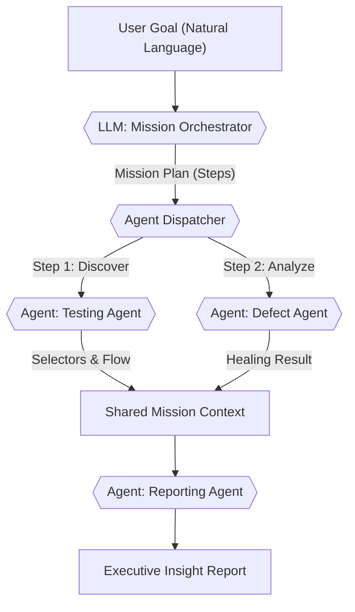
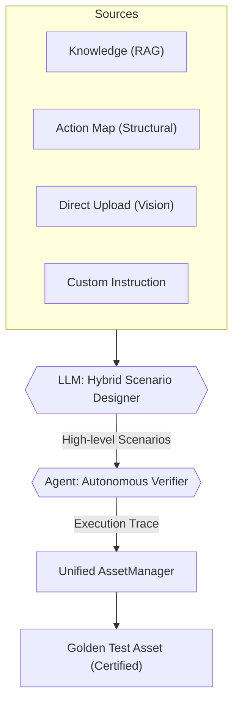
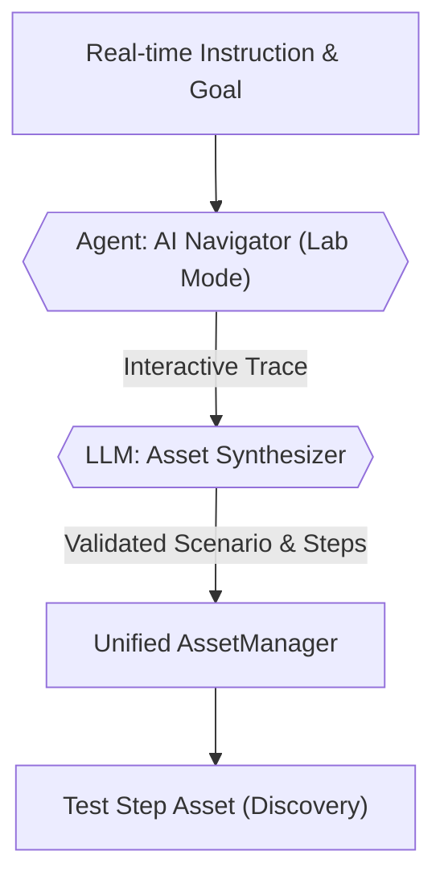
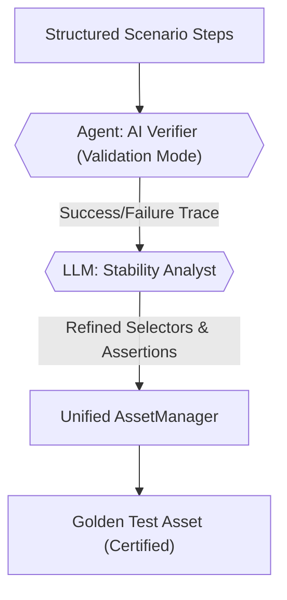

# AI Generator: LLM Specification & Technical Protocol

이 문서는 Q-ONE의 실제 백엔드 소스 코드(`scenarios.py`, `ai.py`, `exploration.py`, `asset_manager.py`) 분석을 기반으로 작성되었습니다. AI 에이전트(Oracle)과 Google Gemini 3 모델 간의 통신 프로토콜, 프롬프트 전략 및 입출력 규격을 정의하며, LLM 튜닝 및 성능 최적화를 위한 실질적인 참조 자료로 사용됩니다.

---

## 1. 개요 및 핵심 기술 (Core Technical Foundation)

Q-ONE의 AI Generator는 Gemini 3 모델을 핵심 엔진으로 사용하여 시나리오 설계부터 실행 데이터 생성, 그리고 자율 탐색을 통한 자산화까지의 전 과정을 자동화합니다.

*   **LLM Engine**: Google Gemini 3 (Flash Preview) - 멀티모달 분석(이미지+텍스트) 및 JSON Schema 출력이 핵심.
*   **Browsing/Crawl**:
    *   **WEB**: Step Flow (CrawlerService) - 헤드리스 브라우저 제어 및 DOM 트리 추출.
    *   **APP**: Appium (app_step_runner) - Android/iOS 네이티브 앱 UI 및 XML 소스 분석.
*   **Vision Analysis**: 스크린샷과 최적화된 DOM 구조를 동시에 LLM에 주입하여 요소 식별 정확도 극대화.
*   **Final Output**: **Step Flow Asset (JSON)** - Q-ONE Step Runner에서 즉시 실행 가능한 단계별 액션 시퀀스.
*   **Automation Pipeline**: AI Generator를 통해 생성된 고수준 시나리오는 'Auto-Verification' 과정을 통해 실제 UI와 대조되며, 최종적으로 실행 가능한 **Test Step Asset (JSON Action Sequence)**으로 자산화됩니다. 이 자산은 Step Runner에 의해 무인 실행됩니다. `{{FIELD}}` 형태의 변수를 자동 주입(Parameterization)하는 최적화가 포함됩니다.

---

## 2. Hybrid Scenario Generation (다층 컨택스트 기반 시나리오 설계)
*   **진입점**: `/scenarios/analyze-hybrid`
*   **모델**: `gemini-3-flash-preview`
*   **핵심**: 지식 저장소(RAG), 액션 플로우 맵, 업로드 파일, 페르소나, 테스트 전략을 단일 고차원 컨텍스트로 결합하여 비즈니스 로직과 UI 구조가 완벽히 결합된 시나리오를 설계함.

### 2.1. Master System Prompt Strategy
```text
You are an Expert QA Automation Engineer.
Analyze the following multi-source hybrid context (Knowledge, Maps, Files, User Prompt).
Your goal is to design a comprehensive Test Scenario Suite that satisfies both business rules and technical UI flows.

[CRITICAL INSTRUCTION]
- Steps MUST be High-level User Intents or Business Logic goals.
- Language: Korean (한국어).
- Output: Standard Q-ONE Scenario JSON.

[Context Fusion Rules]
1. Knowledge (RAG): Apply technical specs, business policies, and domain rules.
2. Action Flow Maps: Align with the discovered UI structure and confirmed selectors.
3. Analysis Strategies: Focus on the chosen modes (e.g., Main, Exception, Regression).
```

### 2.2. Payload Specification (입력 데이터 모델)
*   `item_ids`: 지식 저장소 내 RAG 아이템 ID 리스트. (비즈니스 로직 및 명세)
*   `map_ids`: 저장된 액션 플로우 맵 ID 리스트. (UI 구조 및 선택자)
*   `files`: 사용자가 직접 업로드한 이미지/PDF/텍스트 데이터. (Vision 분석 및 변동 사항)
*   `strategies`: 테스트 전략 리스트 (`Main`, `Negative`, `Security`, `UX`, `Performance`).
*   `prompt`: 사용자의 추가 지시 사항 및 특수 요구 조건.
*   `persona_id`: 대상 페르소나 ID (행동 패턴 및 스킬 레벨 결정).

### 2.3. Output Format (Standard Scenario JSON)
백엔드 `CreateScenarioRequest` 스키마와 100% 호환되는 구조로 생성됨.
```json
{
  "scenarios": [
    {
      "title": "시나리오 제목",
      "description": "상세 시나리오 설명",
      "category": "추천 카테고리 (예: 결제 프로세스)",
      "testCases": [
        {
          "title": "테스트 케이스 명",
          "preCondition": "사전 조건",
          "inputData": "사용될 테스트 데이터",
          "steps": ["Step 1: ...", "Step 2: ..."],
          "expectedResult": "기대 결과 텍스트 (Landmark)"
        }
      ]
    }
  ]
}
```

#### 사용 시점 (Trigger & Flow)
*   **시스템 진입**: 'AI Generator > SCENARIOS' 탭.
*   **Trigger**: 왼쪽 소스 패널에서 지식(Knowledge), 맵(Map), 업로드 파일을 복합적으로 선택하고 전략을 체크한 뒤 **'Generate Scenarios'** 클릭.
*   **Sync Flow**: 
    1. 프론트엔드에서 선택된 모든 소스 ID와 원시 데이터를 수집.
    2. `/analyze-hybrid` 호출하여 LLM 기반 통합 분석 수행.
    3. 생성된 시나리오 초안(Draft)을 **Scenario Sandbox**에서 검토 및 편집.
    4. **'Register'** 클릭 시 백엔드 DB에 정식 자산으로 등록.


---

## 3. Agentic Browsing Protocols (에이전틱 브라우징 규격)
Q-ONE의 자율 브라우징 시스템은 목적에 따라 두 가지 특화된 에이전트 모드로 운영됩니다. 두 모드는 동일한 브라우징 엔진을 공유하지만, 프롬프트의 지향점과 사용자와의 인터랙션 방식에서 차이가 있습니다.

### 3.1. AI Agent Navigator (실험실용: 대화형 탐색 에이전트)
*   **목적**: 사용자와 실시간으로 소통하며 미지의 UI 경로를 탐색하고 새로운 테스트 시나리오를 발굴.
*   **LLM 시스템 메시지 (System Prompt)**:
```text
You are an AI Agent Navigator in the "AI Agent Lab".
Goal: {req.goal}
Persona Context: {req.persona_context}
Commander's Latest Instruction (User Feedback): {req.user_feedback} 

[CORE MISSION]
1. Explore the UI dynamically to achieve the requested goal.
2. If the Commander (User) provides a new instruction via 'user_feedback', prioritize it IMMEDIATELY to override previous plans.
3. Share your 'thought' process in Korean, explaining WHY you made certain decisions to the user.
```

### 3.2. AI Scenario Verifier (제너레이터용: 시나리오 검증 에이전트)
*   **목적**: 이미 생성된 시나리오와 단계(Steps)가 실제 UI에서 충실히 동작하는지 검증하고 확증함.
*   **LLM 시스템 메시지 (System Prompt)**:
```text
You are an AI Scenario Verifier for "AI Generator".
Scenario to Verify: {req.goal} (Contains structured steps)
Persona Context: {req.persona_context}

[CORE MISSION]
1. Follow the provided scenario steps FAITHFULLY. Do not deviate unless the element is missing or UI has changed.
2. Focus on "Assertion & Landmark Verification". Ensure the 'actual_observed_text' strictly verifies the step outcome.
3. Report status as 'Failed' if the pre-defined scenario cannot be completed as written.
```

### 3.3. Common Prompt Logic & Output (공통 추론 및 입출력 규격)
*   **진입점**: `/exploration/step`
*   **모델**: 지연 속도를 고려하여 `flash` 모델 선호.

#### CRITICAL RULES (공통 규칙)
1.  **ASSERTION VERIFICATION (actual_observed_text)**: 현재 화면에서 발견된 **이전 단계 성공의 증거(Landmark)** 문자열을 반드시 추출하여 기록. (가장 중요)
2.  **ASSERTION PREDICTION (expected_text)**: 다음 액션 후 나타날 것으로 예상되는 **EXACT 문자열** 미리 예측.
3.  **STUCK PREVENTION**: 3회 이상 동일 루프 반복 시 'Failed' 처리 및 원인 기술.
4.  **LANGUAGE**: 모든 'thought', 'observation', 'description' 필드는 **한국어**로 작성.

#### Output Schema (JSON)
```json
{
  "step_number": N,
  "matching_score": 0-100,
  "observation": "직전 단계 결과 관찰 내용",
  "thought": "에이전트의 사고 과정 및 판단 근거",
  "action_type": "click/type/scroll/wait/finish",
  "action_target": "css_selector or xpath",
  "action_value": "입력값 또는 스크롤 방향",
  "expected_text": "다음 화면 예측 문자열 (Next State Assertion)",
  "actual_observed_text": "현재 화면 관찰 문자열 (Previous Step Verification)",
  "description": "사용자 화면용 요약 문구",
  "status": "In-Progress/Completed/Failed"
}
```

#### 사용 시점 (Trigger)
*   **AI Agent Lab**: 사용자의 실시간 지시 및 목표 달성 시까지 무한 루프 주행.
*   **Auto-Verification**: 설계된 시나리오의 마지막 스텝을 완료할 때까지 순차 주행.


---

## 4. Synthetic Data Generation (테스트 데이터 생성)
*   **진입점**: `/ai/generate-data`

### 4.1. Prompt Logic (데이터 생성 프롬프트)
```text
Act as a Test Data Engineer. Generate synthetic test data for the following test scenarios.
Target Scenarios: {scenarios_text}
Required Data Types: {data_types_text} (VALID, INVALID, SECURITY)

Output Format: JSON Array of Objects with keys: 'field', 'value', 'type', 'description', 'expected_result'.

[Constraints]
1. 'field' should match the input fields mentioned in the scenarios.
2. 'type' should be one of the required data types.
3. 'value' should be realistic and appropriate for the type.
4. 'description' should explain why this value is chosen (e.g., "Valid email format", "SQL Injection pattern").
5. 'expected_result' MUST be an EXACT literal text string (Landmark) that should appear on the screen at the end of the iteration.
   - Do NOT write descriptions or sentences (e.g., "Page title is...").
   - Write ONLY the bit-for-bit text value (e.g., "Welcome", "로그인에 실패하였습니다", "Search Results").
   - For INVALID/SECURITY data, this is usually the specific error message text.
```

### 4.2. Output Schema
```json
[
  {
    "field": "필드명",
    "value": "생성된 값",
    "type": "VALID/INVALID/SECURITY",
    "description": "값 생성 근거",
    "expected_result": "화면에 노출될 실제 정적 텍스트"
  }
]
```

#### 사용 시점 (Trigger)
*   **UI**: 'Dataset Studio'에서 특정 시나리오를 선택하고 'Generate Synthetic Data' 클릭 시 실행.
*   **Flow**: 해당 시나리오에서 사용할 수 있는 유효(Valid), 무효(Invalid), 보안(Security) 데이터를 생성함.


---

## 5. Executive Intelligence Report (경영 리포트 생성)
*   **진입점**: `/exploration/analyze_report`

### 5.1. Prompt Content (분석 프롬프트)
```text
You are a QA Intelligence Analyst. Your task is to write an "Executive QA Intelligence Report" in Markdown format based on the provided test telemetry data.

Context: Project: {req.project_name}, Period: {req.period}
Telemetry Data: Executions: {req.stats.totalRuns}, Pass Rate: {req.stats.passRate}%, Failure Patterns: {req.stats.diagnosis}
Golden Path Status: Tracking stats for Exploration, Generator, Manual, and Step Builder.

Instruction:
Write a professional, concise executive summary in Korean (한국어). The report should include:
1. Executive Summary: QA 건전성 및 단계 평가 (Stable/Needs Attention/Critical)
2. Key Risk Areas: 실패 패턴 분석 및 원인 가설 (Root cause hypothesis)
3. Stability Trends: 성공률 추이 및 허용 수준 평가.
4. Actionable Recommendations: 안정성 개선을 위한 2~3가지 핵심 구체적 권고 사항.

Tone: Professional, analytical, objective.
No introductory text like "Here is the report". Start directly with single # title.
```

#### 사용 시점 (Trigger)
*   **UI**: 'Analytics & Reports' 메뉴에서 분석 기간 설정 후 'Export Intelligence' 클릭 시 실행.
*   **Flow**: 누적된 테스트 통계(Telemetry)를 바탕으로 경영층을 위한 인사이트 보고서를 자동 생성함.


---

## 6. AI Fallback Service (Self-Healing)
*   **파일**: `fallback_service.py`
*   **목적**: 테스트 실패 발생 시, AI가 실패 원인(Failure Analysis)과 기존 시나리오/스텝 정보를 바탕으로 자율 브라우징을 수행하여, 변경된 UI나 로직에 맞게 테스트 스크립트를 자동으로 교정(Healing)합니다.

### 6.1. Vision-AI Fallback Prompt
```text
You are a 'Self-Healing' Vision-AI Testing Agent.

Goal: {goal}
Platform: {platform}
Current Page: {title} ({current_url})
Context: {cred_context} / {persona_str}
{analysis_context}
{original_script_context}

Previous Steps (During Current Recovery):
{history_summary}

Simplified UI Structure (XML/HTML):
{xml_structure}

---
SELF-HEALING & VISION INSTRUCTIONS:
1. REPAIR, DON'T REWRITE: Your primary job is to HEAL the original script. Preserve the sequence of steps as much as possible.
2. PROBLEM SOLVING: If a step failed (e.g., selector changed), find the new selector. If a popup appeared, close it. If a wait is needed, add it.
3. ROBUST ASSERTIONS: If an assertion failed step because of a volatile value (like a count '944 items'), suggest a more robust assertion that focuses on static text (e.g., "items") or partial matches instead of specific numbers.
4. IMAGE REASONING: A screenshot of the current screen is attached. Use it to find elements that might be missing from the XML or to understand visual context.
5. For 'action_target', you can use CSS/XPath/Text/ID.
6. Focus on ACHIEVEMENT OF THE GOAL within the framework of the original script.

[CRITICAL RULES]
- THOUGHT and DESCRIPTION must be in Korean (한국어).
- Available actions: navigate, click, type, scroll, wait, finish.
```

### 6.2. Output Schema
```json
{
    "thought": "이유 및 전략 상세 (Korean)",
    "action_type": "navigate/click/type/scroll/wait/finish",
    "action_target": "CSS/XPath/Text/ID",
    "action_value": "text to type",
    "assert_text": "검증할 텍스트 (Rule Assertion)",
    "description": "동작 요약 (Korean)",
    "status": "In-Progress/Completed/Failed"
}
```

#### 사용 시점 (Trigger)
*   **UI**: **Execution Status > Defect Management** 목록에서 실패한 자산에 대해 **'Self-healing'** 버튼 선택 시 실행됩니다. (버튼 노출 여부는 각 테스트 자산의 'Enable Self-healing' 설정에 따라 결정됩니다.)
*   **Flow**: 실패 분석 결과(RCA)와 원본 스텝을 LLM 컨텍스트로 주입받아, 중단된 시점부터 목표 달성을 위한 최적의 경로를 재탐색하고 성공 시 수정된 스텝 정보를 제안하거나 자산을 업데이트합니다.


---

## 7. AI Test Step Generator (테스트 스크립트 전환 프로토콜)
*   **개요**: 생성된 시나리오와 테스트 케이스를 실제 실행 가능한 **Step Flow (단계별 액션)**로 변환합니다.
*   **입력**: `Scenario JSON`, `Project Context`, `Persona`
*   **출력**: **Test Step Asset (JSON Action Sequence)**
*   **진입점**: `/scripts/generate`
*   **목적**: 시나리오 자산을 실행 가능한 JSON Action Sequence로 변환.

### 7.1. Expert Automation Engineer Prompt
```text
        You are an Expert QA Automation Engineer.
        Convert the following Test Scenarios into a structured **Step Flow (Action Sequence)** for the Q-ONE Step Runner.
        Each step must be an object with: action, selector_type, selector_value, input_value, and description.

PROJECT CONTEXT: {request.projectContext}
BASE URLS: {base_urls}
USER PERSONA: {request.persona}

SCENARIOS TO IMPLEMENT: {scenarios_json}

[Step Generation Standards]
1. Output MUST be an array of Step objects.
2. Each Step MUST include: 
   - `action`: (click, type, navigate, scroll, wait, finish)
   - `selector_type`: (css, xpath, id, text, accessibility_id)
   - `selector_value`: Actual locator string
   - `input_value`: Data to type or URL to navigate to
   - `description`: Korean explanation of the step
3. Add a 'final_assertion' step at the end based on the Expected Result.
4. TAILOR TO PERSONA: Ensure the level of detail and step complexity matches the provided USER PERSONA.
```

### 7.2. Output Schema
```json
{
    "steps": [
        {
            "action": "STRING",
            "selector_type": "STRING",
            "selector_value": "STRING",
            "input_value": "STRING",
            "description": "STRING"
        }
    ],
    "tags": ["tag1", "tag2"]
}
```

#### 사용 시점 (Trigger)
*   **UI**: AI Generator > **Auto-Verification** 탭에서 시나리오 선택 후 **'Auto-Verify'** 및 성공 후 **'Save as Asset'** 클릭 시 실행.
*   **Flow**: 정적으로 정의된 시나리오 문서를 에이전트가 탐색하여 실제 UI와 매핑된 JSON Action Sequence 자산으로 변환함.


---

## 8. AI Auto-Categorization (Taxonomy Expert)
*   **파일**: `asset_manager.py`
*   **목적**: 생성된 테스트 자산을 프로젝트의 기존 카테고리 체계에 맞게 자동 분류.

### 8.1. QA Taxonomy Expert Prompt
```text
You are a QA Taxonomy Expert.
Target Project Category List: [{cats_str}]

Exploration Goal: {goal}
Executed Steps: {steps_summary}

Based on the goal and steps, assign exactly ONE category from the provided list that best fits this test scenario.
If none fit perfectly, pick 'Common' or the closest match.

Return ONLY the name of the category.
```

#### 사용 시점 (Trigger)
*   **UI/Internal**: 'AI Exploration' 탐색 종료 후 결과물을 'Save/Assetize' (자산화) 하는 시점.
*   **Flow**: 탐색된 목표와 전체 스텝을 분석하여 프로젝트의 기존 카테고리 트리(Project Taxonomy) 중 가장 적합한 위치를 백엔드에서 자동 추천하고 할당함.

---

## 9. AI Failure Analysis (지능형 장애 분석)
*   **진입점**: `/history/analyze-failure` (또는 `AIAnalysisService`)
*   **목적**: 테스트 실패 원인을 기술적/비즈니스적 관점에서 자동 분석하여 조치 가이드를 제공합니다.

### 9.1. Failure Diagnosis Prompt
```text
당신은 QA 자동화 테스트 전문가이자 장애 분석 AI입니다.
테스트 실행 중 발생한 실패(Failure)를 분석하고 원인과 해결 방안을 제시해 주세요.

[테스트 정보]
- 스크립트명: {script_name}
- 플랫폼: {platform}
- 발생한 에러: {failure_reason}

[실행 로그 (마지막 20줄)]
{log_summary}

---
[분석 지침]
1. 첨부된 스크린샷(실패 시점)과 로그를 종합적으로 분석하세요.
2. 실패 원인이 코드 문제인지, UI 변경(Selector) 문제인지, 혹은 환경/네트워크 문제인지 판단하세요.
3. 해결을 위한 구체적인 가이드(코드 수정 제안 등)를 포함하세요.
4. 모든 텍스트 답변은 한국어(Korean)로 작성해 주세요.
```

### 9.2. Output Schema
```json
{
    "thought": "분석 과정 및 추론 (상세)",
    "reason": "실패의 직접적인 원인 요약 (한 문장)",
    "suggestion": "구체적인 해결 방안/수정 가이드",
    "confidence": "0~100 사이의 분석 신뢰도 숫자"
}
```

#### 사용 시점 (Trigger)
*   **Execution Flow**: 테스트 실행 종료 후 상태가 **'failed'**일 경우, 히스토리 저장 직전에 백엔드(Executor/Run Service)에서 자동으로 트리거됩니다.
*   **Flow**: 실패 시점의 스택 트레이스, 실행 로그, 마지막 스크린샷(멀티모달)을 LLM에 주입하여 즉각적인 장애 분석(RCA)을 수행하고 그 결과를 히스토리 데이터와 함께 저장합니다. 사용자는 UI에서 이미 분석된 결과를 즉시 확인할 수 있습니다.

---

## 10. Agent Control Center: Unified Orchestration (통합 오케스트레이션)

Agent Control Center는 사용자의 모호한 목표를 해석하고, 이를 달성하기 위해 분산된 전문 에이전트들을 조율하는 Q-ONE의 핵심 지능 중추입니다.

### 10.1. Mission Orchestrator (Planning Engine)
사용자의 자연어 명령을 실행 가능한 하위 과업(Sub-tasks)으로 분해하고 최적의 에이전트를 배정하는 상위 플래닝 엔진입니다.

*   **진입점**: `/api/v1/ai/chat`
*   **Hybrid Intent Interpretation**: 키워드 매칭(retry, healing 등)과 LLM의 문맥 분석을 결합하여 `Testing`, `Defect`, `Reporting`, `Jira`의 4대 핵심 의도를 분류합니다.
*   **Goal Decomposition Prompt**:
```text
You are the "Chief Mission Orchestrator" of Q-ONE. Analyze the User's Goal into actionable steps.

[Intent Classification]
- If goal mentions 'retry/fix/healing' -> Defect Agent.
- If goal mentions 'report/summary/insight' -> Reporting Agent.
- If goal mentions 'test/check/verify' -> Testing Agent.

[Plan Generation]
1. Break down into 3-7 logical steps.
2. Ensure each step N provides context for N+1.
```

*   **Mission Plan Schema (JSON)**:
```json
{
  "mission_id": "uuid",
  "goal": "사용자 입력 목표",
  "steps": [
    {
      "id": 1,
      "agent": "testing/defect/reporting",
      "tool": "navigator/verifier/healer/analyzer",
      "instruction": "구체적 지시문",
      "expected_outcome": "단계 완료 조건"
    }
  ]
}
```

### 10.2. Agent Fleet Coordination (Social Intelligence)
각 도메인에 특화된 에이전트들이 `MissionState`를 공유하며 협업하는 Multi-Agent System(MAS) 구조입니다.

*   **Agent Specialization**:
    *   **Testing Agent**: "성실한 탐험가" - DOM 구조 분석 및 엣지 케이스 발굴.
    *   **Defect Agent**: "정밀한 분석가" - 실패 로그 RCA 및 복구 경로 탐색.
    *   **Reporting Agent**: "통찰력 있는 전략가" - 텔레메트리 요약 및 인사이트 도출.
*   **Shared Mission Context**: 에이전트 간의 원활한 협업을 위해 `shared_memory` 필드를 포함한 컨텍스트 객체가 전파됩니다.

### 10.3. AI Unified Workflow (Process Flow)
실제 실행 엔진(`MainConsole.tsx`)의 동작 흐름과 100% 일치하는 종합 워크플로우 맵입니다.



---

## 11. CI/CD Intelligence LLM Engine (배포 지능화 엔진)

CI/CD Intelligence(PipelineWatcher)는 개발 배포 파이프라인의 메타데이터와 테스트 자산을 실시간으로 매핑하고, 배포 증분(Delta)에 따른 품질 공백을 AI가 스스로 설계하는 엔진입니다.

### 11.1. Autonomous Impact Analysis (영향도 분석 프롬프트)
*   **프롬프트 전략**:
```text
You are a CI/CD Intelligent Test Orchestrator. 
Analyze the Deployment Metadata and mapping with the Available Test Scripts.
Identify the SINGLE most relevant test script for this deployment.
Return ONLY JSON: {"scriptId": "ID", "reason": "reason string"}
```

### 11.2. Coverage Gap Analysis & Scenario Proposal
*   **프롬프트 전략**:
```text
Analyze the Test Result vs Deployment Goal.
Build Delta: "{deployment_description}"
Identify the "Quality Gap" and generate a new high-level Test Scenario object to cover this gap.
```

---

## 12. AI Workflow Diagrams (LLM-Based Process Flows)

Q-ONE의 AI 서비스는 크게 **시나리오 중심(Scenario-Driven)**과 **목표 중심(Goal-Driven)**이라는 두 가지 워크플로우를 가집니다.

### 12.1. Workflow 1: AI Generator (Scenario-Driven)


### 12.2. Workflow 2: AI Agent Lab (Navigator Agent)


### 12.3. Workflow 3: AI Generator Verify (Verifier Agent)


### 12.4. 핵심 차이점 요약 (Key Comparison)
| 구분 | AI Generator (Smart Gen) | AI Exploration (Discovery) |
| :--- | :--- | :--- |
| **출발점** | 설계서, 화면 구조, **페르소나** | 사용자 목표, **페르소나** |
| **핵심 LLM** | Scenario Designer (Section 2) | Self-Driving Agent (Section 3) |
| **에이전트 역할** | 설계된 시나리오가 맞는지 **학습/검증** | 목표를 위해 스스로 **경로 탐색** |
| **주요 가치** | 기획/설계 기반의 정밀한 테스트 생성 | 발견되지 않은 결함 및 사용자 행동 탐색 |

---

