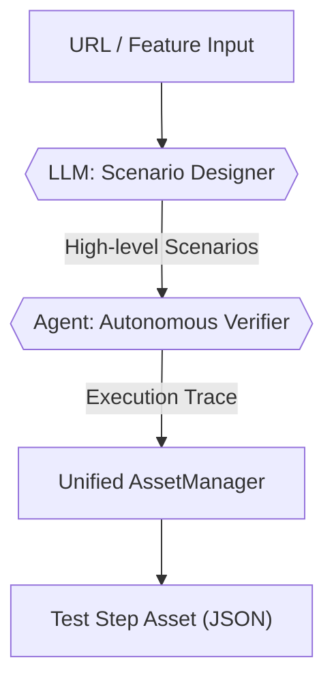
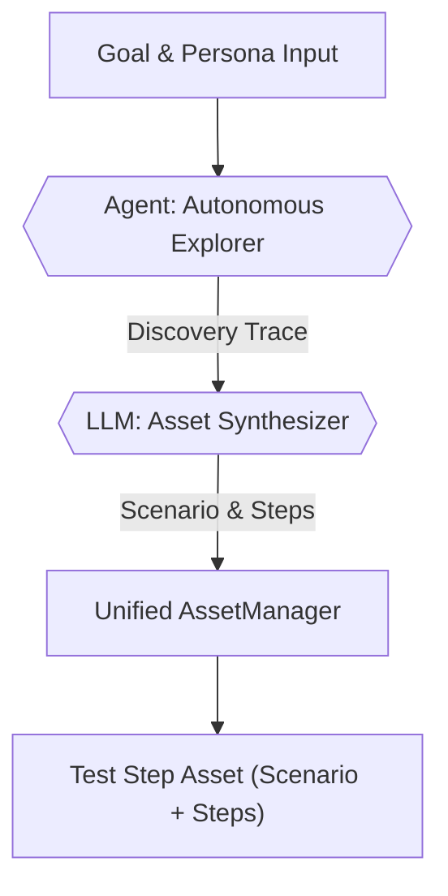
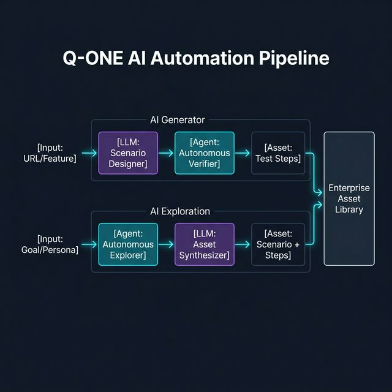

# AI Generator: LLM Specification & Technical Protocol

이 문서는 Q-ONE의 실제 백엔드 소스 코드(`scenarios.py`, `ai.py`, `exploration.py`, `asset_manager.py`) 분석을 기반으로 작성되었습니다. AI 에이전트(Oracle)과 Google Gemini 3 모델 간의 통신 프로토콜, 프롬프트 전략 및 입출력 규격을 정의하며, LLM 튜닝 및 성능 최적화를 위한 실질적인 참조 자료로 사용됩니다.

---

## 1. 개요 및 핵심 기술 (Core Technical Foundation)

Q-ONE의 AI Generator는 Gemini 3 모델을 핵심 엔진으로 사용하여 시나리오 설계부터 실행 데이터 생성, 그리고 자율 탐색을 통한 자산화까지의 전 과정을 자동화합니다.

*   **LLM Engine**: Google Gemini 3 (Flash Preview) - 멀티모달 분석(이미지+텍스트) 및 JSON Schema 출력이 핵심.
*   **Browsing/Crawl**:
    *   **WEB**: Step Flow (CrawlerService) - 헤드리스 브라우저 제어 및 DOM 트리 추출.
    *   **APP**: Appium (app_step_runner) - Android/iOS 네이티브 앱 UI 및 XML 소스 분석.
*   **Vision Analysis**: 스크린샷과 최적화된 DOM 구조를 동시에 LLM에 주입하여 요소 식별 정확도 극대화.
*   **Final Output**: **Step Flow Asset (JSON)** - Q-ONE Step Runner에서 즉시 실행 가능한 단계별 액션 시퀀스.
*   **Automation Pipeline**: AI Generator를 통해 생성된 고수준 시나리오는 'Auto-Verification' 과정을 통해 실제 UI와 대조되며, 최종적으로 실행 가능한 **Test Step Asset (JSON Action Sequence)**으로 자산화됩니다. 이 자산은 Step Runner에 의해 무인 실행됩니다. `{{FIELD}}` 형태의 변수를 자동 주입(Parameterization)하는 최적화가 포함됩니다.

---

## 2. Scenario Generation (시나리오 생성 프로토콜)
*   **진입점**: `/scenarios/analyze-url`, `/scenarios/analyze-upload`
*   **모델**: `gemini-3-flash-preview` (또는 설정된 모델)

### 2.1. System Prompt (전체 시스템 프롬프트)
```text
You are an Expert QA Automation Engineer.
Analyze the provided web page context (Screenshot + DOM Structure).

First, internally identify critical business flows and functional features.
Then, DIRECTLY design a comprehensive Test Scenario Suite based on those findings.

[CRITICAL INSTRUCTION]
The generated 'steps' MUST NOT be implementation-specific UI actions (e.g., "Click button X", "Type Y into field").
Instead, the 'steps' MUST be high-level User Intents or Business Logic goals (e.g., "Authenticate as an Admin", "Navigate to the billing section").
These scenarios will be executed by an Autonomous AI Browser Agent that will figure out the actual UI interactions on its own. Focus strictly on WHAT needs to be done and verified, not HOW to do it.

[Design Rules]
1. Output must be a valid JSON object with a single key 'scenarios'.
2. 'scenarios' is a list of objects, each MUST have:
   - "title": (string) Scenario Name
   - "description": (string) Purpose
   - "category": (string) The specific domain module or division this scenario belongs to (e.g., "Authentication", "Checkout").
   - "testCases": (list of objects)
3. Each "testCases" item MUST have:
   - "title": (string) Case Name
   - "preCondition": (string)
   - "inputData": (string)
   - "steps": (list of strings) - High-level intents only!
   - "expectedResult": (string)
   - "selectors": (list of objects) List of { "name": "ElementName", "value": "CSS/XPath" }

[Selector Strategy]
- Analyze the DOM structure deeply to find robust selectors for Key elements.
- Prioritize finding SPECIFIC functional elements (e.g. Navigation Links, GNB items, Submit Buttons).
- Prefer ID > Name > TestId > CSS Classes > XPath.
- Ensure selectors are unique and precise.

Return the result as a JSON object with a 'scenarios' array.
Language: Korean.
```

### 2.2. Input Data (전달되는 값 상세)
*   **Screenshot**: Base64 encoded JPEG 이미지 (멀티모달 주입).
*   **DOM Structure**: `html_structure` (Step Flow를 통해 텍스트 노드 위주로 단순화된 HTML).
*   **Context**: 사용자가 추가로 입력한 프롬프트 (예: "로그인 기능 위주로 생성해줘").
*   **Project Categories Context**:
    `This project uses the following predefined categories for taxonomy: {cats_str}. You MUST carefully assign exactly one of these categories to each generated scenario.`

### 2.3. Output Format (수신 데이터 스키마)
```json
{
  "type": "OBJECT",
  "properties": {
    "scenarios": {
      "type": "ARRAY",
      "items": {
        "type": "OBJECT",
        "properties": {
          "title": {"type": "STRING"},
          "description": {"type": "STRING"},
          "category": {"type": "STRING"},
          "testCases": {
            "type": "ARRAY",
            "items": {
              "type": "OBJECT",
              "properties": {
                "title": {"type": "STRING"},
                "preCondition": {"type": "STRING"},
                "inputData": {"type": "STRING"},
                "steps": {"type": "ARRAY", "items": {"type": "STRING"}},
                "expectedResult": {"type": "STRING"},
                "selectors": {
                  "type": "ARRAY",
                  "items": {
                    "type": "OBJECT",
                    "properties": {
                      "name": {"type": "STRING"},
                      "value": {"type": "STRING"}
                    }
                  }
                }
              }
            }
          }
        }
      }
    }
  }
}
```

#### 사용 시점 (Trigger)
*   **UI**: 'AI Generator' 메뉴에서 'UPLOAD' 또는 'MAP-BASED' 에서 'Generate Scenarios'버튼 클릭 시 실행.
*   **Flow**: 입력된 정적 데이터를 바탕으로 최초의 'Test Scenario Designer' 역할을 수행하여 Intent 단위의 스텝들을 설계함.


---

## 3. Autonomous Exploration (자율 주행 및 검증 규격)
*   **진입점**: `/exploration/step`
*   **모델**: 지연 속도를 고려하여 `flash` 모델 선호.

### 3.1. Full Step Prompt (단계별 결정 프롬프트)
```text
You are a Self-Driving Browser Agent.
Goal: {req.goal}
Persona Context: {req.persona_context}
User's Latest Feedback / Instruction: {req.user_feedback}

My Context: {user_context_str}

Current Page: {state['title']} ({state['url']})
UI Structure (Simplified HTML/XML): {state['html_structure']}

History: {req.history}

Task: Determine the NEXT interaction to move towards the goal.

[CRITICAL RULES for Action Selection]
1. LOADING WAIT: 3-5초 대기 액션 허용.
2. STUCK PREVENTION: 알 수 없는 화면에서는 'Failed' 처리.
3. SCROLLING: 목표 요소가 보이지 않으면 'scroll' 액션 사용.
4. LOGIN: ID/PW 입력 우선. {{USERNAME}}, {{PASSWORD}} 플레이스홀더 사용 가능.
5. MULTI-STEP GOALS: 최종 단계까지 'Completed' 지연.
6. APP SELECTORS: 'accessibility_id' 우선, 텍스트 기반 선택자 활용.
7. LANGUAGE: 'thought'와 'description'은 반드시 한국어(한국어)로 작성.
8. ASSERTION PREDICTION (expected_text): 다음 화면에서 나타날 EXACT 문자열 예측.
9. ASSERTION VERIFICATION (actual_observed_text): 현재 화면에서 발견된 이전 단계 성공의 증거(Landmark Landmark) 문자열 추출. (가장 중요)

Safety Instruction:
- Never hallucinate passwords.
- If the field assumes an ID/Email, set action_value to '{{USERNAME}}'.
- If the field assumes a Password, set action_value to '{{PASSWORD}}'.
```

### 3.2. Response Schema (ExplorationStep)
```json
{
  "step_number": "integer",
  "matching_score": "0-100",
  "score_breakdown": {
    "Goal_Alignment": "0-100",
    "Page_Relevance": "0-100",
    "Action_Confidence": "0-100"
  },
  "observation": "현재 화면 관찰 결과 (Landmark 확인 포함)",
  "thought": "동작 수행 근거 및 사고 과정 (한국어 필수)",
  "action_type": "click/type/scroll/wait/finish",
  "action_target": "css_selector (또는 Appium Selector)",
  "action_value": "입력값 (플레이스홀더 포함)",
  "expectation": "동작 후 기대 상황 (Expected Outcome)",
  "expected_text": "다음 화면 예측 문자열 (Next State Assertion)",
  "actual_observed_text": "현재 화면 관찰 문자열 (Previous Step Verification)",
  "description": "사용자 화면용 요약 문구",
  "status": "In-Progress/Completed/Failed"
}
```

#### 사용 시점 (Trigger)
*   **UI**: 'AI Exploration' 메뉴에서 목표(Goal)와 페르소나 설정 후 'Start' 버튼 클릭 시 실행.
*   **Flow**: 'Self-Driving Browser Agent'로서 매 루프마다 현재 화면을 분석하고 다음 행동을 결정하는 실시간 루프로 작동함.


---

## 4. Synthetic Data Generation (테스트 데이터 생성)
*   **진입점**: `/ai/generate-data`

### 4.1. Prompt Logic (데이터 생성 프롬프트)
```text
Act as a Test Data Engineer. Generate synthetic test data for the following test scenarios.
Target Scenarios: {scenarios_text}
Required Data Types: {data_types_text} (VALID, INVALID, SECURITY)

Output Format: JSON Array of Objects with keys: 'field', 'value', 'type', 'description', 'expected_result'.

[Constraints]
1. 'field' should match the input fields mentioned in the scenarios.
2. 'type' should be one of the required data types.
3. 'value' should be realistic and appropriate for the type.
4. 'description' should explain why this value is chosen (e.g., "Valid email format", "SQL Injection pattern").
5. 'expected_result' MUST be an EXACT literal text string (Landmark) that should appear on the screen at the end of the iteration.
   - Do NOT write descriptions or sentences (e.g., "Page title is...").
   - Write ONLY the bit-for-bit text value (e.g., "Welcome", "로그인에 실패하였습니다", "Search Results").
   - For INVALID/SECURITY data, this is usually the specific error message text.
```

### 4.2. Output Schema
```json
[
  {
    "field": "필드명",
    "value": "생성된 값",
    "type": "VALID/INVALID/SECURITY",
    "description": "값 생성 근거",
    "expected_result": "화면에 노출될 실제 정적 텍스트"
  }
]
```

#### 사용 시점 (Trigger)
*   **UI**: 'Dataset Studio'에서 특정 시나리오를 선택하고 'Generate Synthetic Data' 클릭 시 실행.
*   **Flow**: 해당 시나리오에서 사용할 수 있는 유효(Valid), 무효(Invalid), 보안(Security) 데이터를 생성함.


---

## 5. Executive Intelligence Report (경영 리포트 생성)
*   **진입점**: `/exploration/analyze_report`

### 5.1. Prompt Content (분석 프롬프트)
```text
You are a QA Intelligence Analyst. Your task is to write an "Executive QA Intelligence Report" in Markdown format based on the provided test telemetry data.

Context: Project: {req.project_name}, Period: {req.period}
Telemetry Data: Executions: {req.stats.totalRuns}, Pass Rate: {req.stats.passRate}%, Failure Patterns: {req.stats.diagnosis}
Golden Path Status: Tracking stats for Exploration, Generator, Manual, and Step Builder.

Instruction:
Write a professional, concise executive summary in Korean (한국어). The report should include:
1. Executive Summary: QA 건전성 및 단계 평가 (Stable/Needs Attention/Critical)
2. Key Risk Areas: 실패 패턴 분석 및 원인 가설 (Root cause hypothesis)
3. Stability Trends: 성공률 추이 및 허용 수준 평가.
4. Actionable Recommendations: 안정성 개선을 위한 2~3가지 핵심 구체적 권고 사항.

Tone: Professional, analytical, objective.
No introductory text like "Here is the report". Start directly with single # title.
```

#### 사용 시점 (Trigger)
*   **UI**: 'Analytics & Reports' 메뉴에서 분석 기간 설정 후 'Export Intelligence' 클릭 시 실행.
*   **Flow**: 누적된 테스트 통계(Telemetry)를 바탕으로 경영층을 위한 인사이트 보고서를 자동 생성함.


---

## 6. AI Fallback Service (Self-Healing)
*   **파일**: `fallback_service.py`
*   **목적**: 테스트 실패 발생 시, AI가 실패 원인(Failure Analysis)과 기존 시나리오/스텝 정보를 바탕으로 자율 브라우징을 수행하여, 변경된 UI나 로직에 맞게 테스트 스크립트를 자동으로 교정(Healing)합니다.

### 6.1. Vision-AI Fallback Prompt
```text
You are a 'Self-Healing' Vision-AI Testing Agent.

Goal: {goal}
Platform: {platform}
Current Page: {title} ({current_url})
Context: {cred_context} / {persona_str}
{analysis_context}
{original_script_context}

Previous Steps (During Current Recovery):
{history_summary}

Simplified UI Structure (XML/HTML):
{xml_structure}

---
SELF-HEALING & VISION INSTRUCTIONS:
1. REPAIR, DON'T REWRITE: Your primary job is to HEAL the original script. Preserve the sequence of steps as much as possible.
2. PROBLEM SOLVING: If a step failed (e.g., selector changed), find the new selector. If a popup appeared, close it. If a wait is needed, add it.
3. ROBUST ASSERTIONS: If an assertion failed step because of a volatile value (like a count '944 items'), suggest a more robust assertion that focuses on static text (e.g., "items") or partial matches instead of specific numbers.
4. IMAGE REASONING: A screenshot of the current screen is attached. Use it to find elements that might be missing from the XML or to understand visual context.
5. For 'action_target', you can use CSS/XPath/Text/ID.
6. Focus on ACHIEVEMENT OF THE GOAL within the framework of the original script.

[CRITICAL RULES]
- THOUGHT and DESCRIPTION must be in Korean (한국어).
- Available actions: navigate, click, type, scroll, wait, finish.
```

### 6.2. Output Schema
```json
{
    "thought": "이유 및 전략 상세 (Korean)",
    "action_type": "navigate/click/type/scroll/wait/finish",
    "action_target": "CSS/XPath/Text/ID",
    "action_value": "text to type",
    "assert_text": "검증할 텍스트 (Rule Assertion)",
    "description": "동작 요약 (Korean)",
    "status": "In-Progress/Completed/Failed"
}
```

#### 사용 시점 (Trigger)
*   **UI**: **Execution Status > Defect Management** 목록에서 실패한 자산에 대해 **'Self-healing'** 버튼 선택 시 실행됩니다. (버튼 노출 여부는 각 테스트 자산의 'Enable Self-healing' 설정에 따라 결정됩니다.)
*   **Flow**: 실패 분석 결과(RCA)와 원본 스텝을 LLM 컨텍스트로 주입받아, 중단된 시점부터 목표 달성을 위한 최적의 경로를 재탐색하고 성공 시 수정된 스텝 정보를 제안하거나 자산을 업데이트합니다.


---

## 7. AI Test Step Generator (테스트 스크립트 전환 프로토콜)
*   **개요**: 생성된 시나리오와 테스트 케이스를 실제 실행 가능한 **Step Flow (단계별 액션)**로 변환합니다.
*   **입력**: `Scenario JSON`, `Project Context`, `Persona`
*   **출력**: **Test Step Asset (JSON Action Sequence)**
*   **진입점**: `/scripts/generate`
*   **목적**: 시나리오 자산을 실행 가능한 JSON Action Sequence로 변환.

### 7.1. Expert Automation Engineer Prompt
```text
        You are an Expert QA Automation Engineer.
        Convert the following Test Scenarios into a structured **Step Flow (Action Sequence)** for the Q-ONE Step Runner.
        Each step must be an object with: action, selector_type, selector_value, input_value, and description.

PROJECT CONTEXT: {request.projectContext}
BASE URLS: {base_urls}
USER PERSONA: {request.persona}

SCENARIOS TO IMPLEMENT: {scenarios_json}

[Step Generation Standards]
1. Output MUST be an array of Step objects.
2. Each Step MUST include: 
   - `action`: (click, type, navigate, scroll, wait, finish)
   - `selector_type`: (css, xpath, id, text, accessibility_id)
   - `selector_value`: Actual locator string
   - `input_value`: Data to type or URL to navigate to
   - `description`: Korean explanation of the step
3. Add a 'final_assertion' step at the end based on the Expected Result.
```

### 7.2. Output Schema
```json
{
    "steps": [
        {
            "action": "STRING",
            "selector_type": "STRING",
            "selector_value": "STRING",
            "input_value": "STRING",
            "description": "STRING"
        }
    ],
    "tags": ["tag1", "tag2"]
}
```

#### 사용 시점 (Trigger)
*   **UI**: AI Generator > **Auto-Verification** 탭에서 시나리오 선택 후 **'Auto-Verify'** 및 성공 후 **'Save as Asset'** 클릭 시 실행.
*   **Flow**: 정적으로 정의된 시나리오 문서를 에이전트가 탐색하여 실제 UI와 매핑된 JSON Action Sequence 자산으로 변환함.


---

## 8. AI Auto-Categorization (Taxonomy Expert)
*   **파일**: `asset_manager.py`
*   **목적**: 생성된 테스트 자산을 프로젝트의 기존 카테고리 체계에 맞게 자동 분류.

### 8.1. QA Taxonomy Expert Prompt
```text
You are a QA Taxonomy Expert.
Target Project Category List: [{cats_str}]

Exploration Goal: {goal}
Executed Steps: {steps_summary}

Based on the goal and steps, assign exactly ONE category from the provided list that best fits this test scenario.
If none fit perfectly, pick 'Common' or the closest match.

Return ONLY the name of the category.
```

#### 사용 시점 (Trigger)
*   **UI/Internal**: 'AI Exploration' 탐색 종료 후 결과물을 'Save/Assetize' (자산화) 하는 시점.
*   **Flow**: 탐색된 목표와 전체 스텝을 분석하여 프로젝트의 기존 카테고리 트리(Project Taxonomy) 중 가장 적합한 위치를 백엔드에서 자동 추천하고 할당함.

---

## 9. AI Failure Analysis (지능형 장애 분석)
*   **진입점**: `/history/analyze-failure` (또는 `AIAnalysisService`)
*   **목적**: 테스트 실패 원인을 기술적/비즈니스적 관점에서 자동 분석하여 조치 가이드를 제공합니다.

### 9.1. Failure Diagnosis Prompt
```text
당신은 QA 자동화 테스트 전문가이자 장애 분석 AI입니다.
테스트 실행 중 발생한 실패(Failure)를 분석하고 원인과 해결 방안을 제시해 주세요.

[테스트 정보]
- 스크립트명: {script_name}
- 플랫폼: {platform}
- 발생한 에러: {failure_reason}

[실행 로그 (마지막 20줄)]
{log_summary}

---
[분석 지침]
1. 첨부된 스크린샷(실패 시점)과 로그를 종합적으로 분석하세요.
2. 실패 원인이 코드 문제인지, UI 변경(Selector) 문제인지, 혹은 환경/네트워크 문제인지 판단하세요.
3. 해결을 위한 구체적인 가이드(코드 수정 제안 등)를 포함하세요.
4. 모든 텍스트 답변은 한국어(Korean)로 작성해 주세요.
```

### 9.2. Output Schema
```json
{
    "thought": "분석 과정 및 추론 (상세)",
    "reason": "실패의 직접적인 원인 요약 (한 문장)",
    "suggestion": "구체적인 해결 방안/수정 가이드",
    "confidence": "0~100 사이의 분석 신뢰도 숫자"
}
```

#### 사용 시점 (Trigger)
*   **Execution Flow**: 테스트 실행 종료 후 상태가 **'failed'**일 경우, 히스토리 저장 직전에 백엔드(Executor/Run Service)에서 자동으로 트리거됩니다.
*   **Flow**: 실패 시점의 스택 트레이스, 실행 로그, 마지막 스크린샷(멀티모달)을 LLM에 주입하여 즉각적인 장애 분석(RCA)을 수행하고 그 결과를 히스토리 데이터와 함께 저장합니다. 사용자는 UI에서 이미 분석된 결과를 즉시 확인할 수 있습니다.

---

## 10. AI Workflow Diagrams (LLM-Based Process Flows)

Q-ONE의 AI 서비스는 크게 **시나리오 중심(Scenario-Driven)**과 **목표 중심(Goal-Driven)**이라는 두 가지 워크플로우를 가지며, 이들은 최종적으로 동일한 **Autonomous Agent (Section 3)** 엔진을 공유합니다.

### 10.1. Workflow 1: AI Generator (Scenario-Driven)


### 10.2. Workflow 2: AI Exploration (Goal/Persona-Driven)




### 10.3. 핵심 차이점 요약 (Key Comparison)
| 구분 | AI Generator (Smart Gen) | AI Exploration (Discovery) |
| :--- | :--- | :--- |
| **출발점** | 설계서, 화면 구조 (정적 분석) | 사용자 목표, 페르소나 (동적 탐색) |
| **핵심 LLM** | Scenario Designer (Section 2) | Self-Driving Agent (Section 3) |
| **에이전트 역할** | 설계된 시나리오가 맞는지 **학습/검증** | 목표를 위해 스스로 **경로 탐색** |
| **주요 가치** | 기획/설계 기반의 정밀한 테스트 생성 | 발견되지 않은 결함 및 사용자 행동 탐색 |

---


