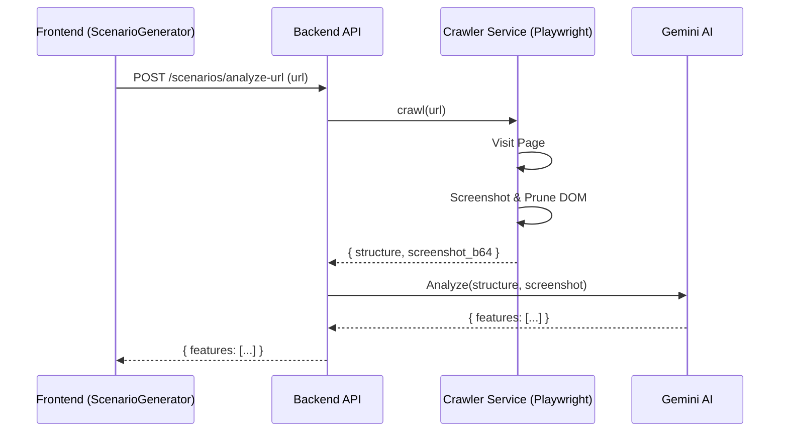

# Implementation Plan - Browsing-based Scenario Generation

The goal is to implement the "Browsing" capability in the Scenario Generator. Instead of pretending to analyze a URL, the system will autonomously visit the target website, extract its structure, and use an LLM to generate test scenarios based on actual UI elements.

## User Review Required
> [!IMPORTANT]
> This feature requires installing `playwright` and its browser binaries on the backend server.
> `playwright install` command must be run after pip installation.

## Architecture

## Proposed Changes

### Backend

#### [Dependencies]
#### [MODIFY] [requirements.txt](file:///d:/03_Aiworkx/01_Q-ONE/prj/qone/backend/requirements.txt)
- Add `playwright` and `beautifulsoup4` (for easier DOM parsing/pruning).

#### [Services]
#### [NEW] [crawler.py](file:///d:/03_Aiworkx/01_Q-ONE/prj/qone/backend/app/services/crawler.py)
- **Class `CrawlerService`**:
    - `crawl(url: str)`:
        - Launches Headless Browser.
        - Navigates to URL.
        - Captures Full Page Screenshot (resized for token efficiency).
        - **DOM Pruning**: Extracts only interactive elements (buttons, inputs, links) and structural containers. Removes scripts, styles, and hidden elements to minimize token usage.
        - Returns structured data + screenshot.

#### [API Endpoints]
#### [NEW] [scenarios.py](file:///d:/03_Aiworkx/01_Q-ONE/prj/qone/backend/app/api/api_v1/endpoints/scenarios.py)
- **Endpoint `POST /analyze-url`**:
    - Calls `CrawlerService.crawl`.
    - Calls Gemini with:
        - **System Prompt**: "You are a QA Engineer. Analyze this UI structure and screenshot."
        - **User Input**: Pruned DOM + Screenshot.
    - Returns `features` list matching the existing frontend interface.

### Frontend

#### [Components]
#### [MODIFY] [ScenarioGenerator.tsx](file:///d:/03_Aiworkx/01_Q-ONE/prj/qone/components/ScenarioGenerator.tsx)
- Update `activeTab === 'browsing'` logic in `handleAnalyzeBase`.
- Instead of calling `GoogleGenAI` client-side directly for browsing, call the new backend endpoint `scenariosApi.analyzeUrl(targetUrl)`.
- Use the returned features to update `persistedFeatures`.

## Token Optimization Strategy
1.  **DOM Pruning**: We will not send the full HTML. We will construct a "simplified accessibility tree" representation (e.g., `<button>Login</button>`, `<input name="email">`). This reduces token count by ~90% compared to raw HTML.
2.  **Image Resizing**: Screenshots will be resized to max 1024px width before sending to Gemini Vision to balance detail and token cost.
3.  **One-Shot Analysis**: We will try to get all main features in a single pass rather than crawling multiple pages initially (MVP).

## Verification Plan
1.  **Dependency Check**: Verify `playwright` is installed and browsers are available.
2.  **Crawl Test**: Send a request with `https://example.com` and verify the backend returns extracted features.
3.  **End-to-End**: Input a target URL in frontend -> Click "Extract" -> Verify logical features are listed.
