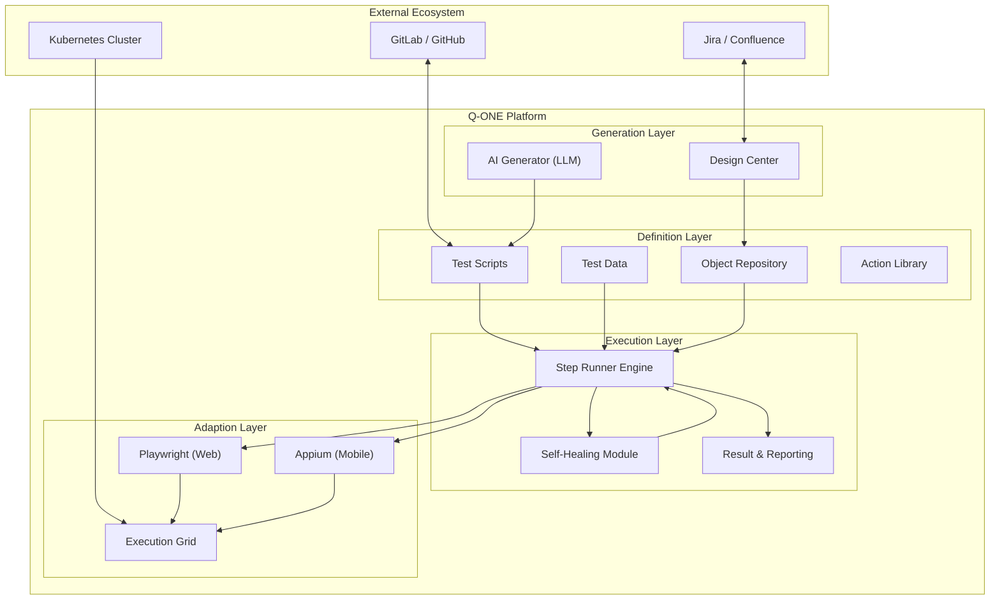

# Q-ONE 기술 아키텍처 (TA) 설계 및 로드맵

## 1. 시스템 개요
Q-ONE은 웹 및 모바일 앱 테스트를 통합 관리하기 위해 설계된 **AI 기반 QA 자동화 플랫폼**입니다. 기존의 코드 중심 자동화에서 벗어나, 생성형 AI(Generative AI)를 활용한 **Low-Code/No-Code** 접근 방식을 통해 엔지니어가 아닌 사용자도 자동화를 수행할 수 있도록 지원하며, 동시에 SDET에게 필요한 강력한 기능을 제공합니다.

아키텍처는 프로젝트 관리(Project Management), 형상 관리(Configuration), 모니터링(Monitoring)과 강력한 테스트 자동화 코어(Test Automation Core)가 통합된 레이어 구조를 따릅니다.

## 2. 통합 에코시스템 아키텍처

Q-ONE은 연결된 에코시스템 내에서 작동하며, 기존 엔터프라이즈 도구와의 원활한 통합을 보장합니다.

### 2.1 관리 및 구성 레이어

| 레이어 | 도구 (예시) | Q-ONE 통합 전략 |
| :--- | :--- | :--- |
| **프로젝트 관리** | **Jira, Confluence** | • **양방향 동기화**: 테스트 결과가 Jira 티켓에 자동으로 업데이트됩니다. • **추적성**: Q-ONE 시나리오와 Jira 스토리/에픽을 연결합니다. |
| **형상 관리** | **GitLab / GitHub** | • **버전 관리**: 테스트 스크립트(Playwright)는 Git에 저장됩니다. • **CI/CD 트리거**: GitLab CI/GitHub Actions에서 Q-ONE 실행을 트리거합니다. |
| **배포** | **Kubernetes (K8s)** | • **확장 가능한 러너**: 테스트 실행 파드(Pod)를 동적으로 프로비저닝합니다. • **Helm 차트**: Q-ONE 플랫폼 자체의 자동화된 배포를 지원합니다. |
| **모니터링** | **Grafana, ELK** | • **관측 가능성**: 테스트 안정성 및 성능에 대한 실시간 대시보드를 제공합니다. • **로그 통합**: 실패 분석을 위한 중앙집중식 로그를 제공합니다. |

---

## 3. 테스트 자동화 코어 아키텍처

Q-ONE의 핵심은 4개의 계층으로 구조화되어 있으며, 이는 업계 최상의 자동화 프레임워크를 반영합니다.

### 3.1 테스트 생성 레이어 (Generation Layer - Brain)
*   **역할**: 테스트 자산의 지능적 생성.
*   **구성 요소**:
    *   **AI 생성기**: NLP 요구사항 -> 테스트 시나리오 -> 실행 가능한 스크립트로 변환.
    *   **모델 통합**: **GPT-4o / Claude 3.5**를 활용하여 로직 생성 및 자가 수정 수행.
    *   **수동 설계**: AI가 생성한 테스트를 사용자가 검토하고 수정할 수 있는 "Design Center".

### 3.2 테스트 정의 레이어 (Definition Layer - Structure)
*   **역할**: *무엇*을 테스트할지 정의 (데이터, 로직, 순서).
*   **구성 요소**:
    *   **테스트 케이스 (스크립트)**: Playwright 기반 Python 스크립트, 재사용을 위해 모듈화됨.
    *   **테스트 데이터**: 분리된 데이터 관리 (유효/무효/보안 데이터셋).
    *   **오브젝트 리포지토리**: 스크립트와 독립적으로 관리되는 중앙집중식 UI 선택자 (XPath/CSS).
    *   **액션 라이브러리**: 재사용 가능한 비즈니스 로직 블록 (예: "로그인", "결제").

### 3.3 테스트 실행 레이어 (Execution Layer - Runner)
*   **역할**: 정의된 테스트를 안정적으로 실행.
*   **구성 요소**:
    *   **하이브리드 러너**: 디버깅을 위한 **로컬(Headful)** 및 CI/CD를 위한 **원격(Headless)** 모드 지원.
    *   **자가 치유 엔진(Self-Healing)**: 런타임 실패 감지 시 Vector DB 유사도 검색을 통해 복구 시도 (도입 예정).
    *   **리포팅**: 비디오/스크린샷 증거가 포함된 포괄적인 HTML/JSON 보고서.

### 3.4 테스트 어댑션 레이어 (Adaption Layer - Interface)
*   **역할**: 테스트 대상 시스템(SUT)과의 상호작용.
*   **구성 요소**:
    *   **프로토콜 어댑터**: Playwright (Web), Appium (Mobile), REST Assured (API).
    *   **디바이스 팜**: **DeviceSTF** 또는 클라우드 팜(BrowserStack/SauceLabs) 연동을 통한 실물 디바이스 테스트.
    *   **시뮬레이션**: 격리된 테스트를 위한 서비스 가상화 / API 모킹.

---

## 4. AI QA Agent 기술 스택 (Technology Stack)
Q-ONE의 "AI Agent" 기능을 구현하기 위한 핵심 기술 요소입니다.

| 컴포넌트 | 역할 | 추천 기술 (Tech Stack) | 비고 |
| :--- | :--- | :--- | :--- |
| **Brain (두뇌)** | 추론, 계획, 결정 | **GPT-4o**, **Claude 3.5 Sonnet** (Vision 포함), **LLaMA 3** (On-Prem) | 멀티모달(Vision) 능력이 필수적임. |
| **Orchestrator (지휘)** | 에이전트 워크플로우 관리 | **LangGraph**, **AutoGPT**, **LangChain** | 복잡한 작업(ReAct 패턴)의 상태 관리. |
| **Memory (기억)** | 지식 저장 및 검색 | **ChromaDB**, **Pinecone**, **Milvus** | 테스트 이력, DOM 스냅샷, 매뉴얼 임베딩 저장. |
| **Tools (도구)** | 실제 환경 제어 | **Playwright Tool Use**, **Jira API**, **Gmail API** | LLM이 호출할 수 있는 함수(Function Calling) 집합. |
| **Planning (계획)** | 문제 해결 전략 | **CoT (Chain of Thought)**, **ReAct**, **Tree of Thoughts** | "로그인 실패 -> 비밀번호 재설정 시도" 등의 추론 과정. |

---

## 5. 미래 기술 청사진 (Future Technology Blueprint)

### 5.1 1단계: 인지 지능 (AI & Vision)
*   **비전-언어 모델 (VLM)**:
    *   *목표*: "자율 주행" 테스트.
    *   *기술*: **LLaVA / GPT-4o-V**.
    *   *이점*: AI가 UI 요소를 시각적으로 인식하고 상호작용하여 "잘 깨지는 선택자(Flaky Selector)" 문제 해결.
*   **벡터 메모리 (Vector Memory)**:
    *   *목표*: 지능형 자가 치유.
    *   *기술*: **ChromaDB / Pinecone**.
    *   *이점*: 단순 검증을 넘어, 과거 스냅샷과 비교하여 UI 상태 변경을 정확하게 판단.

### 4.2 2단계: 초고확장성 (Hyper-Scalability)
*   **서버리스 / 컨테이너 그리드**:
    *   *목표*: 1000개 이상의 테스트 병렬 실행.
    *   *기술*: **KEDA (Kubernetes Event-Driven Autoscaling)**.
    *   *이점*: 비용 효율적인 확장. 테스트 큐가 있을 때만 워커 파드(Pod) 생성.

### 4.3 3단계: 엔터프라이즈 이벤트 메시 (Enterprise Event-Mesh)
*   **이벤트 기반 아키텍처**:
    *   *목표*: 결합도를 낮춘 비동기 처리.
    *   *기술*: **Apache Kafka / RabbitMQ**.
    *   *이점*: 블로킹 없이 다수의 CI 파이프라인에서 발생하는 대량의 테스트 요청 처리.

---

## 5. 아키텍처 다이어그램 (Mermaid)

